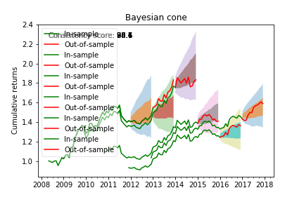

# Bayesian_Cone

### Introduction
When evaluating trading algorithms we generally have access to backtest results over a couple of years and a limited amount of paper or real money traded data. The biggest with evaluating a strategy based on the backtest is that it might be overfit to look good only on past data but will fail on unseen data. In this blog, we will take a stab at addressing this problem using Bayesian estimation and prediction of possible future returns we expect to see based on the backtest results. 

### Why Bayesian method?
In the Bayesian approach we do not get a single estimate for our model parameters as we would with maximum likelihood estimation. Instead, we get a complete posterior distribution for each model parameter, which quantifies how likely different values are for that model parameter. For example, with few data points our estimation uncertainty will be high reflected by a wide posterior distribution. As we gather more data, our uncertainty about the model parameters will decrease and we will get an increasingly narrower posterior distribution. There are many more benefits to the Bayesian approach, such as the ability to incorporate prior knowledge that are outside the scope of this blog post.

A more detailed explanation and application can be found at <https://www.quantopian.com/posts/predicting-future-returns-of-trading-algorithms-bayesian-cone#strongwhy-bayesian-modelsstrong>
